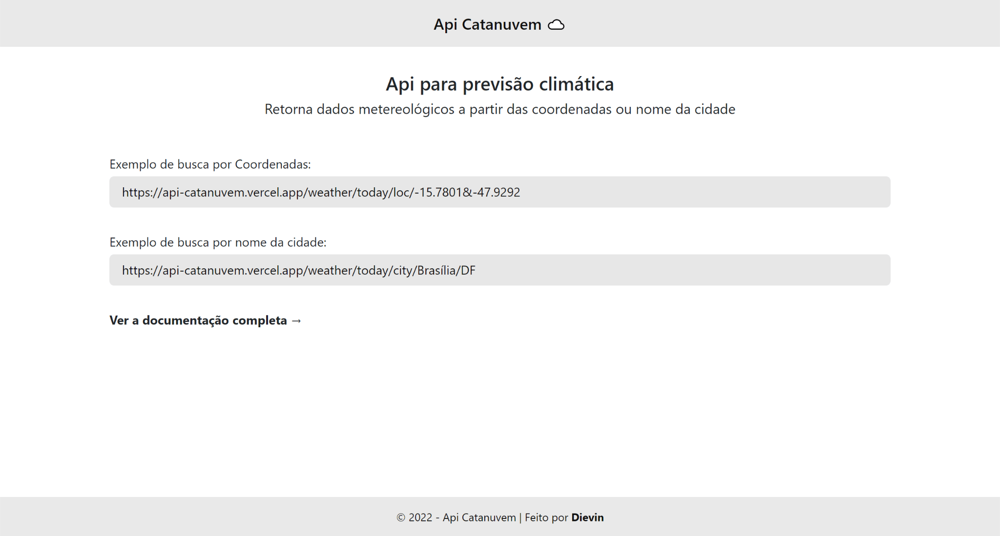

# Api Catanuvem ☁️
> Projeto construído em Node JS/Express.

Api para previsão climática.

Veja a api em funcionamento aqui: https://api-catanuvem.vercel.app



## Sobre

Api Catanuvem é um projeto pessoal criado a partir de um projeto hobbie que necessitava de dados sobre a condição climática. Apesar de já existir soluções de api's gratuitas para usar, decidi criar uma solução própria com os requisitos ideais para meu projeto. Na qual compreendi melhor os processos e foi de grande aprendizado.

## Features

- Response em formato JSON
- Busca por coordenadas ou nome da cidade
- Previsão do clima hoje
- Previsão do clima próximas 5 horas
- Previsão do clima próximos 5 dias

## Como utilizar?

Para usar a api de previsão climática utilize o path **/weather** em seguida informe o período da consulta:
- **/today**  para hoje
- **/hours** para próximas horas
- **/days** para próximos dias

Depois de inserir o período, informe o método de busca:
#### #Busca por coordenadas
- **/loc/:lat&:lon**

Exemplo de busca por coordenadas:
```
 https://api-catanuvem.vercel.app/weather/today/loc/-15.7801&-47.9292
```
Veja que logo após o **/loc** informamos a latitude **&**(não esqueça esse cara entre eles) longitude

#### #Busca por nome da cidade
- **/city/:name/:state**

Exemplo de busca por nome da cidade:
```
 https://api-catanuvem.vercel.app/weather/today/city/Brasília/DF
```
Veja que logo após o **/city** informamos o nome da cidade e em seguida a sigla do estado.

***Obs***: O nome da cidade passado na url deve ser inserido com espaços normalmente, caso ele conter.

✅ Certo: São Paulo

❌ Errado: SãoPaulo

O resultado de nossa busca retornaria os dados do clima para **hoje** em **Brasília, Distrito Federal** seria esse:

```
{
    "location": "Brasília, Distrito Federal",
    "temperature": "23°",
    "condition": "Encoberto",
    "dayAndNight": "Dia 28° • Noite 19°",
    "icon": {
        "name": "Mostly Cloudy",
        "src": "https://api-catanuvem.vercel.app/icons/Mostly%20Cloudy.svg"
    },
    "precipitation": "68%",
    "feelsLike": "23°",
    "wind": "16 km/h",
    "humidity": "72%",
    "dewPoint": "17°",
    "pressure": "1015.2 mb",
    "uvIndex": "0 de 10",
    "visibility": "9.66 km",
    "moon": "Lua crescente",
    "climateVariation": {
        "max": "--",
        "min": "19°"
    },
    "airQuality": {
        "score": "44",
        "quality": "Boa",
        "description": "A qualidade do ar é considerada satisfatória, e a poluição do ar representa risco pequeno ou nulo."
    },
    "sun": {
        "sunrise": "5:36",
        "sunset": "18:14"
    },
    "todayForecast": [
        {
        "period": "Manhã",
        "temperature": "26°",
        "icon": {
            "name": "Partly Cloudy",
            "src": "https://api-catanuvem.vercel.app/icons/Partly%20Cloudy.svg"
        },
        "precipitation": "--"
        },
        {
        "period": "Tarde",
        "temperature": "24°",
        "icon": {
            "name": "Mostly Cloudy",
            "src": "https://api-catanuvem.vercel.app/icons/Mostly%20Cloudy.svg"
        },
        "precipitation": "--"
        },
        {
        "period": "Noite",
        "temperature": "21°",
        "icon": {
            "name": "Thunderstorm",
            "src": "https://api-catanuvem.vercel.app/icons/Thunderstorm.svg"
        },
        "precipitation": "71%"
        },
        {
        "period": "A noite",
        "temperature": "20°",
        "icon": {
            "name": "Cloudy",
            "src": "https://api-catanuvem.vercel.app/icons/Mostly%20Cloudy.svg"
        },
        "precipitation": "24%"
        }
    ]
}
```

Para saber mais sobre o retorno de cada chave e seus valores, consulte a seção [Dicionário: Keys do response](https://api-catanuvem.vercel.app/docs#dicionario "Dicionário das chaves") na documentação da api.

## Tecnologias

Projeto foi construído com as seguintes tecnologias:

- Javascript
- Node.js
- Express
- Axios
- Cheerio
- MongoDB (Mongoose)
